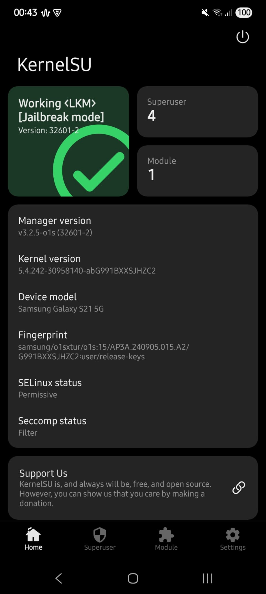

# DFRoot for S21 (SM-G991B, G991BXXSJHZC2)

Ephemeral root for Samsung S21 (locked bootloader) via DirtyFrag (CVE-2026-43284),
plus a working KernelSU stack. Based on [diabl0w/DFRoot](https://github.com/diabl0w/DFRoot)
(`@diabl0w github/xda`); S21 port and everything below by the fork.



Target kernel: `5.4.242-30958140-abG991BXXSJHZC2` (Samsung o1s, Android 15).
This is a **non-GKI** vendor kernel: no GKI symbols/ABI, trimmed kallsyms,
CFI + PAC + RKP + DEFEX enforced. The LKM therefore resolves everything at
runtime (custom symbol resolver), uses tracepoint + task_work instead of
kprobes/text-patch, and never touches read-only tables. Expect per-firmware
porting (addresses, vermagic) — nothing here is drop-in for other builds.

> [!WARNING]
> No responsibility for damage. Reboot wipes root (LKM, no persistence).

## What was built on top

- **Exploit → `sud` daemon** (`dfmod/sud.c`): stateless root shell over
  `/dev/.sud`. Every app-side call is one `sh -c` fork with output in `/dev/dfOUT`.
- **KernelSU LKM** (`kernel-ksu/`): su redirect + allowlist grant, throne/manager
  fd-install, per-namespace apex CA injection, lazy module umount, SELinux-hide
  hooks. Samsung KDP/RKP/DEFEX/CFI-safe (tracepoint + task_work only, no text patch).
- **`mrun.sh`** (device: `/data/adb/ksu/mrun.sh`): Magisk-style module runner —
  file-bind + dir-mirror mounts, CA staging, zygote/app-ns injection with verify,
  `/system_ext/bin` su+busybox mirror for bare-`su` in every shell.
- **`ksudshim.sh`**: manager-compatible `ksud` CLI over mrun (install/enable/
  disable/uninstall/action). `feature save` and friends are stubs (no daemon).
- **Manager** (`manager/`, versionCode 32601): release build,
  Flash console for uninstall, apex refresh on open, dead settings greyed out
  (classic-su, kernel-umount locked on, SELinux-hide without reboot toast).
- **Boot chain**: BOOT_COMPLETED posts a full-screen notification only — exploit
  and load run *exclusively* with the activity window open (background load =
  panic/Odin risk). Foreground guard aborts `insmod` if the window closes.

## Layout (self-contained clone)

- `dfmod/` — stager sources.
- `kernel-ksu/` — KernelSU LKM source. Build:
  `S21_ROOT_OVERRIDE=/path/to/S21 bash scripts/build-kernelsu.sh KSU_GIT_VERSION=2601
  KSU_EXPECTED_SIZE=0x2E8 KSU_EXPECTED_HASH=a86318b5… KSU_MANAGER_PACKAGE=me.weishu.kernelsu`
- `manager/` — manager source (`KSU_MANAGER_VERSION_CODE=32601` release).
- `scripts/` — kernel build wrappers (need sibling `toolchains/` +
  `kernel-G991BXXSJHZC2` tree via `S21_ROOT_OVERRIDE`, plus `ANDROID_HOME` SDK/NDK).
- `lkm/` — legacy DirtyFrag module sources.
- External (NOT in repo): `toolchains/`, `kernel-G991BXXSJHZC2/`.

## Flow

Manual: open the app → **Launch Root** (exploit, window stays open) →
**Load KernelSU** when rooted → mounts + services.

Autoboot: reboot → tap the DFRoot notification (let it open full-screen)
→ window stays on → exploit → 2s settle → load KernelSU automatically.
Same result, no taps. Background load never happens (panic/Odin guard).

```sh
./build.sh
adb install -r dirtyfrag.apk
```

## Known issues / limits

- Root exec of `/data` binaries is killed by DEFEX — including busybox as root.
  busybox works as shell; root work uses sh/toybox.
- No Zygisk (LSPosed etc. install but never inject).
- No `overlayfs` tricks anywhere near `/system` (hardlockup → watchdog reset).
